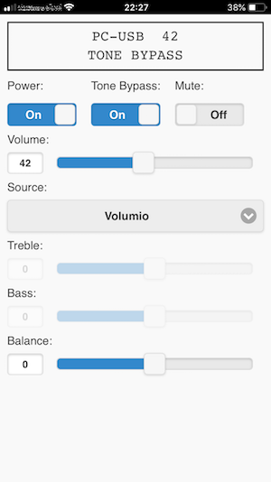

# Rotel Web Client for A12 / A14 amplifier

This is basically Claes Holmerson's Rotel Web Client (for Rotel RA-12 amp) modified for Rotel A12 (and A14) amplifier.
Apart from translating his project to the RS232-protocol used by A12 and A14, I made some minor adjustments to somehow deal with a problem which might be related to my specific setup:
Responses from the amp tend to be split in many parts (often just one character) and these parts sometimes arrive in the wrong order.

I am using a Raspberry Pi 3B+ (running Volumio) with a USB to RS232 adapter to control my A12 amplifier.
Rotel's A14 amplifier uses the same protocoll, so theoretically it should also work.

If you have a Rotel A12 or A14 amp, you could use this project to control it from your phone or any device with a modern web browser. 

**All credits to Claes Holmerson.**  
Being a complete noob to javascript, I would have never been able to create this from scratch.

## Instructions

Connect the Rotel amplifier with a serial cable to a computer. Check what serial port device it creates (for example "/dev/ttyUSB0").

On the computer, download and start the serial-port-json-server service: https://github.com/chilipeppr/serial-port-json-server 
This software you can download pre-compiled for a multitude of computer architectures.
It exposes the serial port as a websocket, accessible for example from Javascript in a HTML page.

The web page and its javascript resources are best served from a http server so you can access it from your home network.
I put them in the /volumio/http/www/rotel directory on my Raspberry Pi running Volumio, taking advantage of Volumio's web server.
And then access it from http://my-address-here/rotel/index.html

Adjust the rotelConfig.js file in this project and update the setting "websocketUrl" to refer to the address of the serial-port-json-server service. 
You also want to adjust the setting "serialPortDevice" if it differs from the default '/dev/ttyUSB0'.

Load index.html in your web browser. The javascript loaded by this page will connect to the serial-port-json-server and through it communicate with the Rotel amplifier. Now you can control power, volume, source, balance and tone controls. 
The communication is bi-directional, so if you change the volume using the volume knob on the amplifier or the regular remote, the web interface will reflect that.

## Tips

By adjusting the config properties in rotelConfig.js, you can name your music sources ("TV", "Chromecast" etc). Label properties set to null will be disabled.

## Problems 

The project is tested with Rotel A12. It should work with the A14, as it uses the same protocol, although I couldn't test that.
Other newer amps (e.g. RA-1572 or RA-1592) seem to implement similar protocols and use the same commands / responses for many functions.
Chances are, you can use this translation for these amps as well if they run on the newest software. In any case, I recommend checking http://www.rotel.com/manual-resources/rs232-protocols for protocol specifications for different models. 

The Rotel protocol sometimes mixes responses in the wrong order. Even though I tried to account for that, you might get the wrong feedback from the amp from time to time.

At the moment, volumes <10 don't work. This should not be a real problem, as you should always play your music much louder than that!

The A12 and A14 can be equiped with 2 pairs of loudspeakers. As I only have one pair, I didn't bother implementing a switch for speaker selection.

I included a minimal manifest.json so you can add this to the homescreen of your smartphone (or tablet) and it runs as standalone webapp.
I didn't include Rotel icons, though (for copyright reasons).

